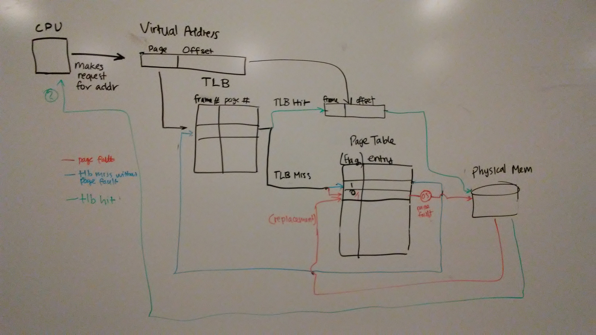
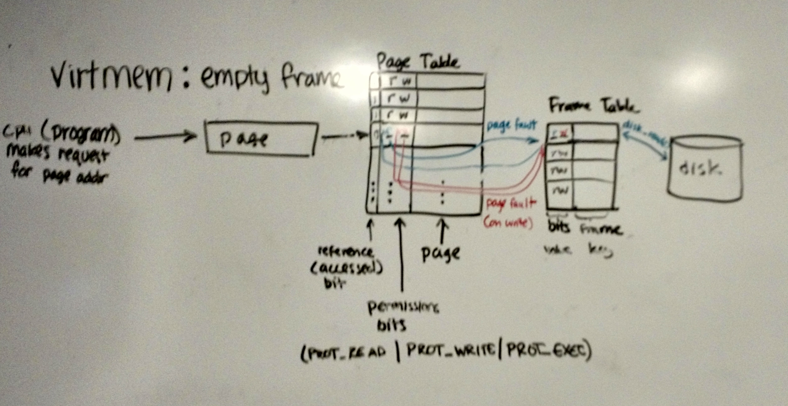
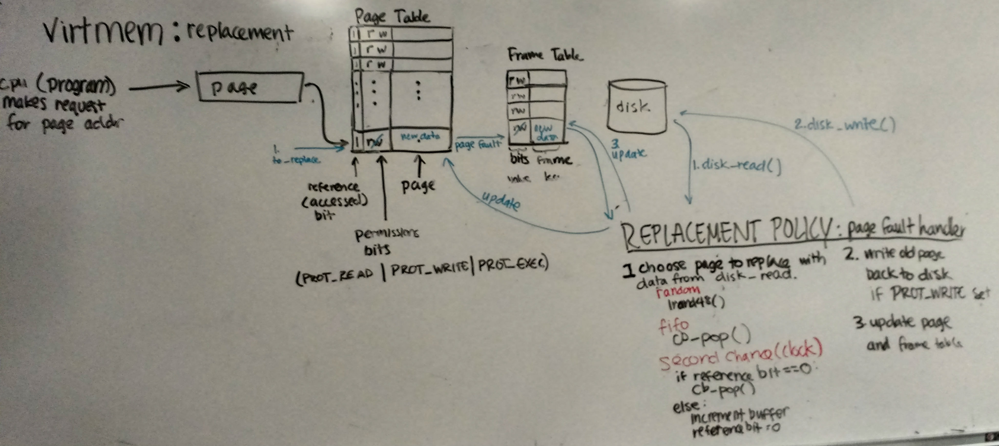

## virtmem: Virtual Memory in C
###### Implementation and analysis of page replacement policies

### To download and for usage and setup instructions, check out our [github repository](https://github.com/bishiguro/SoftSysPeskyPintos).

## Authors

[Apurva Raman](https://github.com/apurvaraman/), [Bonnie Ishiguro](https://github.com/bishiguro/), [Andrew Pan](https://github.com/apan64), [Amy Wu](https://amybohbeanii.github.io/)

## Abstract

To understand virtual memory better, we built `virtmem`, a fully functional demand paged virtual memory in C following the guidance of [Notre Dame University’s VM project](http://www3.nd.edu/~cpoellab/teaching/cse30341/project4.html).  This project implementation allows us to understand the code mechanics of how the operating system handles memory addressing, page faults, and page replacement.

Our team explored implementations of virtual memory by working with processes and algorithms involved in looking up virtual addresses in the page table and handling page faults.  There are many commonly used algorithms for page replacement and documentation on how virtual memory works, and our team’s goal was to gain a better understanding of virtual memory by implementing parts of the system ourselves.  

## Background

Virtual memory refers to the memory addressing the OS uses for its processes, which is mapped to physical addresses through the usage of a page table.  On a request from a process to read or write to a position in memory, the memory management unit (MMU) attempts to look for the mapping from a virtual to physical address in the translation lookaside buffer (TLB).  If the address in not found in the buffer, the MMU then looks up the virtual address in the page table.  The mapping to the physical address is then added to the TLB, and the MMU attempts to find the virtual address in the TLB again.  When the virtual address is found in the TLB, the corresponding physical address is then passed to main memory so the address space can be read from or written to.

###### Figure 1: A common general implementation of virtual memory

We focused our project on the implementation of a specific part of virtual memory, page replacement algorithms. This includes understanding how page faults occur and how to handle page faults by creating page replacement algorithms. A page fault occurs when the a process accesses an address in the page table that there isn’t a mapping from virtual to physical memory for, resulting in the page replace algorithm being called. There are many page replacement policies, such as random, first-in first-out (FIFO), least recently used (LRU), and second-chance.
The purpose of our project is to gain a general overview of Virtual Memory. We read ThinkOS Chapter 3: Virtual Memory to understand the different components that make up Virtual Memory (Refer to Figure 1). We read a previous project’s documentation on Virtual Memory in regard to Computer Architecture in order to understand that in the broader context, the concept of Virtual Memory is similar to caching. Understanding virtual memory is an important part of an Operating System and an implementation allows us to demonstrate mastery of the virtual memory concept. Specifically, our team was able to gain a comprehensive understanding of page faults, page table, frame table, disk, and the random, FIFO, and second-chance page replacement algorithms.  For further information from sources we used for information, we created an annotated bibliography with a summary of each source.

## Implementation

#### Implementation details

###### Page replacement algorithms
Our page fault handler is called whenever there is an attempted access to a page that is not mapped to a frame, or when there is an attempted write to a page when all of the pages in the table have an existing mapping.  We implemented multiple page replacement algorithms to address these issues, starting with a random page replacement as an MVP and eventually adding FIFO and second-chance FIFO page replacement with a circular buffer.  

We chose to use a circular buffer to implement FIFO because we knew the maximum size of the buffer had to be equal to the size of the page table, so having a fixed-size circular data structure was more efficient than creating a linked list. We also followed the architecture of implementing a frame table to understand how virtual memory is mapped to physical memory.

###### Structure of our implementation

On a page fault, before attempting replacement, we check for empty frames; if there is an empty frame, we would not want to eject something that could be used in the future from the page table. However, there are two possible causes for page faults. The first is that the page isn't present in the page table (neither PROT_READ nor PROT_WRITE is set). The second is that the program needs to write to that part of memory but write permissions are not set (PROT_WRITE). Figure 2 shows the process of loading the data from disk upon a page fault to an empty frame, as well as setting write bits upon a fault on write.

###### Figure 2: Our implementation of virtual memory showing how empty frames are filled.

Once the frame table is full, we need to replace one of the frames with data from the new page upon a page fault, as shown in Figure 3. The page we choose to replace is dependent on the replacement policy. For random replacement, we pick a random page to replace. For FIFO, we pop the oldest page in our circular buffer. For second chance FIFO, we inspect the reference bit for the oldest page in our circular buffer and pop the page if the reference bit is 0. Otherwise, we set the reference bit to 0 for that page and increment the pointer in the buffer until we get to a page where the reference bit is 0. We added the reference bit to the page table because it allows it to be easily indexed by the page, which keeps us from having to search through the pages.

###### Figure 3: Our implementation of virtual memory showing how pages are replaced.

#### Goals and initial implementation strategies
Our goal for this project was to create a working virtual memory system to handle the mapping from virtual memory to physical memory. Due to the complexity of developing an entire virtual memory system with pages, frames, a page table, and the ability to write to disk, we chose to search for existing virtual memory projects and build upon those instead of creating a system entirely from scratch. We began with exploring virtual memory implementations on Arduino Uno’s and PintOS, a pseudo-OS developed for implementing different OS features as projects for a Stanford course.  After performing some preliminary implementation of both options, we chose to further explore the PintOS project with the intent of completing a virtual memory project in the OS.

#### virtmem's advantages over PintOS
After spending multiple weeks with trying to implement some of the features of PintOS necessary to begin working on virtual memory, we came to the conclusion that the multitude of issues we were running into from the OS was hindering our progress, and we pivoted our project to work on a different virtual memory project: Notre Dame’s Project V: Virtual Memory, which has a much simpler setup and a more readable code base.  This implementation uses only a page table and does not use a TLB. The main goal of our new virtual memory project was to implement a page fault handler that would manage interactions with the page table and page replacement.

## Results

## Annotated Bibliography

### ThinkOS Chapter 3: Virtual Memory:

[http://greenteapress.com/thinkos/html/thinkos004.html](http://greenteapress.com/thinkos/html/thinkos004.html)

We each read TOS chapter 4 before starting this project, and we used it as a reference to the basics of virtual memory theory. It gave us a general overview of the topic, but we needed to consult other resources to learn about the specific parts of virtual memory we would need to implement (ex. TLB, replacement policies, page table). We also read TOS chapter 9 to understand basics of threading in order to build earlier projects in the Stanford Pintos project, which we later pivoted away from in favor of the Notre Dame project.

### Notre Dame Virtual Memory project:

Poellabauer, Christian. "Project IV: Virtual Memory." Operating Systems Principles. N.p., 2016. Web. 30 Apr. 2017.

[http://www3.nd.edu/~cpoellab/teaching/cse30341/project4.html](http://www3.nd.edu/~cpoellab/teaching/cse30341/project4.html)

This was the starting point for our implementation of virtual memory. We used the starter code as well as the diagrams indicating what the desired process and behavior should be. The diagrams helped us understand when to call disk_read() and disk_write() as well as when and how to set permission bits.

### Circular buffer overview:

"Circular buffer." Wikipedia. Wikimedia Foundation, 26 Apr. 2017. Web. 30 Apr. 2017.

[https://en.wikipedia.org/wiki/Circular_buffer](https://en.wikipedia.org/wiki/Circular_buffer)

We used the Wikipedia article for the circular buffer to determine whether it was suitable to use for a FIFO queue for the pages. The article states that if you do not need to resize the buffer, it is more efficient than a linked list because of its fixed size. We realized that this would work for our FIFO queue because we knew the maximum size of the queue would be equal to the size of the page table.

### Page replacement overview:

"Page replacement algorithm." Wikipedia. Wikimedia Foundation, 25 Apr. 2017. Web. 30 Apr. 2017.

[https://en.wikipedia.org/wiki/Page_replacement_algorithm](https://en.wikipedia.org/wiki/Page_replacement_algorithm)

We used the page replacement algorithm when trying to figure out how to implement second-chance FIFO and found the Clock replacement policy, which was close to what we had with the circular buffer. We modified our first-chance FIFO implementation with the circular buffer using the description of how the reference bit should be set and reset.

### Circular buffer tutorial:

Chandrasekaran, Siddharth. "Implementing Circular/Ring Buffer in Embedded C." Embed Journal. EmbedJournal, 16 May 2014. Web. 30 Apr. 2017.

[http://embedjournal.com/authors/siddharth-chandrasekaran](http://embedjournal.com/authors/siddharth-chandrasekaran)

This tutorial helped us write the circular buffer that we used for FIFO and second-chance FIFO. We added additional methods to the buffer and modified it to be less conservative with space and more flexible. 

### Virtual memory project for creating a system to manage memory on a USB:

"Project 5: Virtual Memory." COS 318 : Operating System. Princeton University, 2004. Web. 26 Mar. 2017.

[https://www.cs.princeton.edu/courses/archive/fall04/cos318/projects/5.html](https://www.cs.princeton.edu/courses/archive/fall04/cos318/projects/5.html)

This is a virtual memory project description in Princeton’s Operating Systems class that we referenced as an example of how to structure our virtual memory implementation.

### Stanford Pintos project:

"Project 3: Virtual Memory." Pintos Projects. Stanford University, n.d. Web. 26 Mar. 2017.

[https://web.stanford.edu/class/cs140/projects/pintos/pintos_4.html#SEC53](https://web.stanford.edu/class/cs140/projects/pintos/pintos_4.html#SEC53)

This is a virtual memory project description in Stanford’s Operating Systems class that we started off using for our PintOS implementation, but found that, although quite extensively documented, there were some issues we ran into that we couldn't find documentation for.

### Pintos Reference Guide:

Pfaff, Ben.  “Pintos.”  Stanford University, n.d.  Web.  26. Mar. 2017.

[https://web.stanford.edu/class/cs140/projects/pintos/pintos.pdf](https://web.stanford.edu/class/cs140/projects/pintos/pintos.pdf)

This includes Pintos documentation, the four projects in Stanford’s Operating Systems class, and a guide to setting up Pintos on our machines. In addition to the virtual memory project description referenced above, this includes the first two course projects on threading and user programs, which we will need to either implement or understand solution implementations in order to build a base for our VM. We used this guide to verify that our Pintos installations were successful by running the alarm-multiple program.

### Installing PintOS with QEMU:

[https://pintosiiith.wordpress.com/2012/09/13/install-pintos-with-qemu/](https://pintosiiith.wordpress.com/2012/09/13/install-pintos-with-qemu/)

This is a guide to how to install Pintos using QEMU as the hypervisor rather than Bochs, which speeds up the emulation substantially. We used it to fix some issues we had with paths to Pintos source files being incorrect. It did not explain how or why to use QEMU, but we used the other documentation to determine which hypervisor to use.

### Arduino virtual memory library:

[https://rhelmus.github.io/virtmem/index.html](https://rhelmus.github.io/virtmem/index.html)

Existing implementation of a virtual memory system that runs on Arduino to increase the available amount of RAM through an additional memory source.

## Learning Objectives
This project was intended to be a learning exercise for the team to get hands on experience with implementing an important component of VM, the page fault handler. We accomplished our learning goals, which were:
Learn about all the components of VM
In depth understanding of TLB
In depth understanding of Page Table
In depth understanding of different page replacement algorithms
Mapping of Virtual Address to Physical Address
Physical Memory versus Disk
Design decisions on how to implement a frame table
Data structure decisions on how to implement fifo.

While there are various other page replacement algorithms to implement, this project still proves to be a valuable learning experience for the team to gain in-depth knowledge in VM and experience implementing some page replacement algorithms.
